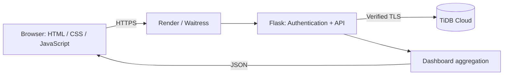

# Expense Tracker

เว็บจัดการรายรับ–รายจ่ายส่วนบุคคลภาษาไทย ตั้งแต่บันทึกรายการจนถึงดูภาพรวมการใช้เงิน
รองรับบัญชีผู้ใช้แยกข้อมูล ตัวกรองร่วม และกราฟสรุป พร้อม deploy ใช้งานจริง

**[ทดลองใช้งาน](https://expense-tracker-sg.onrender.com/)** · **[Project case study](PORTFOLIO.md)**

พัฒนาโดย [Pattanachai Sawetbunchoed](https://github.com/AoojunHappyman)

## จุดประสงค์ของโปรเจกต์

ช่วยให้ผู้ใช้เห็นว่าเงินเข้า–ออกเท่าไร ใช้จ่ายกับหมวดหมู่ใด และยอดแต่ละเดือนเปลี่ยนไปอย่างไร
โปรเจกต์นี้แสดงงานพัฒนาเว็บตั้งแต่ UI, REST API และฐานข้อมูล ไปจนถึงการทดสอบและ deployment

## ฟีเจอร์หลัก

- สมัครสมาชิก เข้าสู่ระบบ และกู้บัญชีด้วยรหัสกู้แบบใช้ครั้งเดียว
- เพิ่ม แก้ไข และลบรายการ พร้อมตรวจข้อมูล ป้องกันการกดบันทึกซ้ำ และกล่องยืนยันลบ
- กรองเดือน หมวดหมู่ และรายรับ–รายจ่าย ให้ตาราง ยอดรวม และกราฟเปลี่ยนพร้อมกัน
- กราฟรายจ่ายตามหมวดหมู่และกราฟรายรับ–รายจ่ายรายเดือนด้วย Chart.js
- Insight หมวดหมู่สูงสุด วันในสัปดาห์ และการเปรียบเทียบเดือนติดกัน รวมเดือนที่ไม่มีรายการ
- หน้าจอปรับตามขนาดอุปกรณ์ พร้อมโหมดสว่างและมืด
- ตรวจเจ้าของข้อมูลฝั่งเซิร์ฟเวอร์ มี CSRF protection และ rate limiting สำหรับระบบบัญชี

## ทดลองใช้งานใน 3 นาที

1. เปิดเว็บและสมัครบัญชีใหม่ด้วยชื่อผู้ใช้ 3–50 ตัว และรหัสผ่าน 12–128 ตัว เก็บรหัสกู้บัญชีที่แสดงหลังสมัคร
2. เพิ่มข้อมูลสมมติ เช่น รายรับ 10,000 บาท และรายจ่ายหมวดอาหาร 150 บาท
3. เพิ่มรายจ่ายของเดือนก่อน แล้วลองเปลี่ยนตัวกรอง ตรวจยอดรวม กราฟ และ Insight
4. ทดลองแก้ไข ยกเลิกการแก้ไข ลบรายการ และสลับโหมดสี

ไม่มีบัญชีสาธิตที่ใช้ร่วมกัน ผู้ทดลองแต่ละคนสมัครบัญชีของตัวเองและใช้ข้อมูลสมมติได้

## เทคโนโลยีและสถาปัตยกรรม

| ส่วน | เทคโนโลยี |
|---|---|
| Frontend | HTML, CSS, JavaScript, Chart.js |
| Backend | Python, Flask, Waitress |
| Database | MySQL-compatible SQL, TiDB Cloud สำหรับเว็บจริง |
| Hosting | Render, HTTPS ผ่าน managed ingress |
| Testing | Python unittest และ integration tests กับ MySQL |



`/api/dashboard` อ่านรายการของเจ้าของบัญชีครั้งเดียว แล้วคำนวณตาราง ยอดรวม กราฟ และ Insight
ด้วย Python เพื่อลดการเรียก API ซ้ำ การตรวจ session ยังมีการอ่านฐานข้อมูลแยกจากรายการ
ไม่มีการอ้างตัวเลขความเร็วที่ยังไม่ได้ benchmark

## โครงสร้างโปรเจกต์

```
expense-tracker/
├── app.py                 # Flask backend + REST API
├── auth.py                # บัญชีผู้ใช้, session และ CSRF
├── dashboard.py           # ตัวกรองและคำนวณข้อมูล dashboard
├── production.py          # ตั้งค่า production และ error responses
├── tests/                 # Unit และ MySQL integration tests
├── schema.sql              # SQL สร้างฐานข้อมูลและตาราง
├── requirements.txt         # Python dependencies
├── .env.example             # ตัวอย่างไฟล์ config (คัดลอกเป็น .env)
├── templates/
│   └── index.html          # หน้าเว็บหลัก
└── static/
    ├── css/style.css       # ดีไซน์ (โทนเดียวกับเว็บเรซูเม่)
    └── js/script.js        # เรียก API, วาดกราฟ, CRUD
```

## วิธีติดตั้งและรัน

### 1. ติดตั้ง MySQL และสร้างฐานข้อมูล

เปิด MySQL แล้วรันไฟล์ `schema.sql`:

```bash
mysql -u root -p < schema.sql
```

คำสั่งนี้จะสร้างฐานข้อมูลชื่อ `expense_tracker`, ตาราง `transactions`,
และตาราง `users` โดยไม่ใส่ข้อมูลตัวอย่างในบัญชีผู้ใช้

### 2. ตั้งค่า environment variables

```bash
cp .env.example .env
```

แล้วเปิดไฟล์ `.env` แก้ `DB_PASSWORD` ให้ตรงกับรหัสผ่าน MySQL ของคุณ

### 3. ติดตั้ง Python packages

แนะนำให้สร้าง virtual environment ก่อน:

```bash
python -m venv venv
source venv/bin/activate      # Windows: venv\Scripts\activate

pip install -r requirements.txt
```

### 4. รันเซิร์ฟเวอร์

```bash
python app.py
```

เปิดเบราว์เซอร์ไปที่ **http://localhost:5000**

## API Endpoints

| Method | Endpoint                     | คำอธิบาย                          |
|--------|-------------------------------|-------------------------------------|
| GET    | `/api/transactions`           | ดึงรายการทั้งหมด (filter ได้: `?category=&start=&end=`) |
| POST   | `/api/transactions`           | เพิ่มรายการใหม่                      |
| PUT    | `/api/transactions/<id>`      | แก้ไขรายการ                         |
| DELETE | `/api/transactions/<id>`      | ลบรายการ                           |
| GET    | `/api/dashboard`              | ตาราง ยอดรวม กราฟ Insight และรายการหมวดหมู่ในคำขอเดียว |
| GET    | `/api/summary`                | สรุปยอดรวม + ข้อมูลสำหรับกราฟ         |
| GET    | `/api/insights`               | วิเคราะห์หมวดหมู่ วันในสัปดาห์ และเปรียบเทียบรายจ่ายรายเดือน |

### GET `/api/insights`

`/api/dashboard`, `/api/summary` และ `/api/insights` รับตัวกรองเดียวกัน:
`month=YYYY-MM`, `category=ชื่อหมวดหมู่`, `type=income|expense` เว้นว่างเพื่อดูทั้งหมด
เดือนหรือประเภทไม่ถูกต้องตอบ HTTP 400

ตัวอย่าง: `/api/dashboard?month=2026-09&type=expense`

| Field | ข้อมูล |
|---|---|
| `top_categories` | หมวดหมู่รายจ่ายสูงสุดไม่เกิน 3 อันดับ: `category`, `total`, `count` |
| `busiest_day` | วันในสัปดาห์ที่มียอดรายจ่ายรวมสูงสุด หรือ `null` เมื่อไม่มีรายจ่าย |
| `day_breakdown` | ยอดรายจ่ายทั้ง 7 วัน เรียงจันทร์ถึงอาทิตย์ |
| `month_comparison` | `current_month`, `previous_month`, `current_total`, `previous_total`, `pct_change` |

การเปรียบเทียบใช้เดือนที่เลือกกับเดือนก่อนหน้าตามปฏิทิน ถ้าไม่เลือกเดือนจะใช้เดือนปัจจุบัน
ตามเวลาไทย ยอดเดือนก่อนคำนวณด้วยตัวกรองหมวดหมู่เดียวกัน แม้อยู่นอกเดือนที่แสดงในตาราง
เดือนที่ไม่มีรายจ่ายนับเป็นศูนย์ เมื่อเดือนก่อนเป็นศูนย์และเดือนนี้มียอด `pct_change` เป็น `null`
เมื่อทั้งคู่เป็นศูนย์จะเป็น `0` และเมื่อกรองเฉพาะรายรับ `month_comparison` เป็น `null`
เทียบยอดทั้งเดือน ไม่ใช่ช่วงจำนวนวันเท่ากัน เดือนปัจจุบันจึงอาจยังมีข้อมูลไม่ครบเดือน

## ระบบบัญชีและการย้ายข้อมูล

- สมัครที่ `/register` เข้าสู่ระบบที่ `/login` และกู้บัญชีที่ `/recover`
- ชื่อผู้ใช้ใช้ a–z, 0–9, `_`, `-` จำนวน 3–50 ตัว รหัสผ่าน 12–128 ตัว
- รหัสผ่านเก็บเป็น hash; รหัสกู้บัญชีสุ่มแสดงเพียงครั้งเดียวและเก็บเป็น hash
- เก็บรหัสกู้บัญชีก่อนออกจากหน้าสมัคร หากลืมรหัสผ่านและทำรหัสนี้หาย จะกู้ด้วยตนเองไม่ได้
- การกู้บัญชีเปลี่ยนรหัสกู้ใหม่และยกเลิก session เก่าทุกอุปกรณ์
- ทุก API ต้องเข้าสู่ระบบ ข้อมูลรายการ สรุป และ Insight จำกัดเฉพาะเจ้าของบัญชี
- คำขอ POST/PUT/DELETE ต้องมี `X-CSRF-Token` จาก meta tag หรือ `csrf_token` ในฟอร์ม

### อัปเกรดฐานข้อมูลเดิม

สำรองฐานข้อมูลก่อนอัปเกรด จากนั้นรันคำสั่งนี้ (รันซ้ำได้):

```powershell
.\venv\Scripts\python.exe -m flask --app app migrate-accounts
```

รายการเดิมยังอยู่ครบ แต่ยังไม่ผูกบัญชีและจะไม่แสดงให้ผู้ใช้ใหม่เห็น
สมัครบัญชีเจ้าของก่อน แล้วรันบนเครื่องเซิร์ฟเวอร์โดยแทน `your_username` ด้วยชื่อบัญชีนั้น:

```powershell
.\venv\Scripts\python.exe -m flask --app app assign-legacy your_username
```

คำสั่งนี้ย้ายเฉพาะรายการที่ยังไม่มีเจ้าของ ไม่เปลี่ยนรายการของบัญชีอื่น
ไม่มี API ให้ผู้ใช้ทั่วไปอ้างสิทธิ์ข้อมูลเดิม

ตั้ง `SECRET_KEY` เป็นค่าสุ่มยาวและเก็บคงเดิมใน environment ของเซิร์ฟเวอร์
หากไม่ตั้ง ระบบใช้ค่าสุ่มชั่วคราว ซึ่งทำให้ session หลุดเมื่อรีสตาร์ตหรือใช้หลาย worker
ตั้ง `COOKIE_SECURE=1` เมื่อเปิดผ่าน HTTPS

### ทดสอบ

```powershell
.\venv\Scripts\python.exe -B -m unittest discover -s tests -v
# Integration tests ต้องมีสิทธิ์สร้าง/ลบฐานข้อมูลทดสอบแยก
$env:RUN_MYSQL_TESTS="1"
.\venv\Scripts\python.exe -B -m unittest discover -s tests -v
```

## หมายเหตุด้านความปลอดภัย

มีระบบบัญชี การตรวจเจ้าของข้อมูล input validation และ CSRF protection แล้ว
มี rate limiting สำหรับ login/register/recover แล้ว
เว็บจริงใช้ HTTPS และ Waitress แล้ว ส่วนการสำรองและทดสอบกู้คืนข้อมูลจริงยังเป็นงานที่ต้องดำเนินการ
ระบบกู้บัญชีเวอร์ชันนี้ใช้รหัสกู้แบบครั้งเดียว ไม่ส่งอีเมล

## จำกัดความถี่การใช้งานบัญชี

| หน้า | ต่อ IP | ต่อชื่อผู้ใช้ (รวมทุก IP) |
|------|--------|--------------------------|
| เข้าสู่ระบบ | 30 ครั้ง / 15 นาที | 10 ครั้ง / 15 นาที |
| สมัครสมาชิก | 5 ครั้ง / 1 ชั่วโมง | — |
| กู้บัญชี | 10 ครั้ง / 15 นาที | 5 ครั้ง / 15 นาที |

นับ POST ที่ผ่าน CSRF ทั้งสำเร็จและไม่สำเร็จ ไม่จำกัดการเปิดหน้า GET
เมื่อเกินโควตาจะตอบ HTTP 429 พร้อม `Retry-After` เป็นวินาทีและข้อความภาษาไทย
หน้าต่างเวลาเริ่มจากครั้งแรก การลองซ้ำขณะถูกจำกัดไม่ยืดเวลารอ
บัญชีที่ถูกจำกัดยังใช้งาน session ที่เข้าสู่ระบบไว้ได้

ตัวนับเก็บในตาราง `auth_rate_limits` ของ MySQL ใช้ร่วมกันทุก worker
และไม่หายเมื่อรีสตาร์ต ใช้ `SECRET_KEY` เดียวกันทุก worker เพื่อสร้างคีย์ HMAC
ไม่เก็บ IP หรือชื่อผู้ใช้เป็นข้อความตรงในตารางนี้
รัน `migrate-accounts` เมื่ออัปเกรดเพื่อสร้างตารางเพิ่มเติม
ล้างตัวนับหมดอายุด้วย `python -m flask --app app purge-auth-limits`
ครั้งละไม่เกิน 10000 แถว โดยรันเป็นระยะนอกขั้นตอน Login
หากฐานข้อมูลตัวจำกัดไม่พร้อม ระบบจะตอบ 503 แทนการปล่อยผ่าน

ระบบใช้ `request.remote_addr` และไม่เชื่อ `X-Forwarded-For` โดยตรง
หากนำขึ้น reverse proxy ต้องตั้ง trusted proxy ให้ตรงโครงสร้างจริงก่อนเปิดใช้งาน
มิฉะนั้นผู้ใช้หลัง proxy อาจถูกนับเป็น IP เดียวกัน

## Production deployment

เตรียม Waitress + Caddy, HTTPS, Secure session cookie และ error handling แล้ว
ดูขั้นตอนและข้อกำหนดที่ [deploy/README.md](deploy/README.md)
เว็บสาธิตใช้ Render และโดเมน onrender.com; ชุด Caddy เป็นทางเลือกสำหรับติดตั้งบน VPS

### Free hosting

สำหรับ Render Free + TiDB Starter ดู [deploy/RENDER.md](deploy/RENDER.md)
ใช้ Blueprint `render.yaml` และ `serve_render.py` แทนชุด Caddy สำหรับ VPS

### Dashboard loading

`GET /api/dashboard` รวม `transactions`, `summary`, `insights` สำหรับผู้ใช้ที่เข้าสู่ระบบ
หน้าเว็บโหลดคำขอเดียวและอ่านรายการครั้งเดียวต่อการโหลด แทนการเรียก 3 API
API เดิมยังใช้งานได้ ไม่มีการ cache ข้อมูลข้ามบัญชี

## ขอบเขตเวอร์ชันแรก

- Dashboard ยังอ่านรายการทั้งหมดของบัญชีก่อนกรอง ไม่มี pagination ฝั่งเซิร์ฟเวอร์
- ยังไม่มีการส่งออก CSV งบประมาณรายเดือน หรือรายการประจำ
- ยังไม่มีระบบลบบัญชีด้วยตนเอง และการกู้บัญชีไม่ใช้อีเมล
- ผลทดสอบในเครื่องไม่ใช่ผลทดสอบโหลดหรือการรับรองความปลอดภัยของระบบจริง

รายละเอียดการตัดสินใจทางเทคนิคและแนวทางนำเสนออยู่ใน [PORTFOLIO.md](PORTFOLIO.md)
